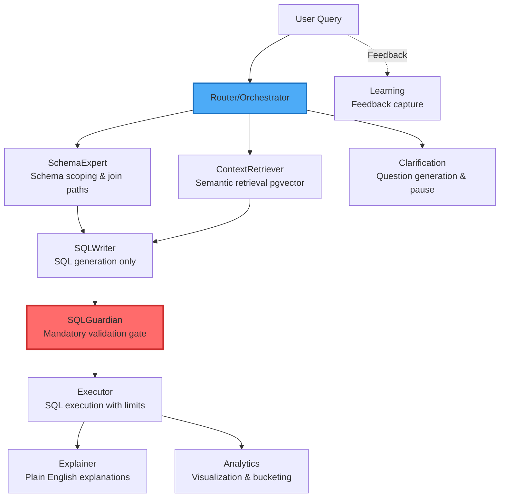
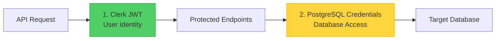

# SequelSpeak

[](https://github.com/cognicai/SequelSpeak/actions/workflows/tests.yml)
[](https://codecov.io/gh/cognicai/SequelSpeak)
[](https://www.python.org/downloads/)
[](https://fastapi.tiangolo.com)
[](https://react.dev)

> **An advanced agentic, schema-aware Text-to-SQL system** that converts natural language queries into safe, validated PostgreSQL SQL using a **PersonaPlex-inspired architecture**.

## Overview

SequelSpeak employs an innovative **Router + Personas** architecture that enforces correctness through structural boundaries rather than relying solely on LLM reasoning. The system implements:

- **Multi-layer security**: Clerk JWT authentication + per-request PostgreSQL credentials + input validation
- **Test suite**: 665 tests across 41 files (14 subdirectories), gated at 85%+ coverage in CI
- **Production-ready observability**: Structured JSON logging, correlation IDs, Prometheus metrics, health monitoring
- **Fail-fast validation**: Pydantic models + planned SQLGuardian as a mandatory security gate
- **Async-first design**: FastAPI + psycopg connection pooling with retry logic, circuit breaker
- **Stateful conversations**: Redis-backed `ConversationState` with TTL and in-memory fallback
- **Internal data plane**: Postgres + Alembic migrations for user profiles, encrypted Redis credential cache (AES-256-GCM)

### Design Philosophy

> *"Don't make the LLM think harder — force correct behavior through architecture."*

Instead of relying on prompt engineering, SequelSpeak enforces correctness through:
- **Explicit architectural boundaries** (Router + isolated Personas)
- **Contract-based interfaces** (no implicit context passing)
- **Observable state transitions** (correlation IDs, structured logging, persona traces)

---

## Architecture

### Core Pattern: Router + Personas



### Key Architectural Invariants

1. Each persona accepts **only explicitly passed inputs** (no implicit context)
2. Any ambiguity must be surfaced to the **Router** (fails fast)
3. Personas have **single responsibility** (no Swiss Army knife agents)
4. **No SQL generated before SQLGuardian approval**
5. All state transitions are **observable and traceable** via `persona_trace` and correlation IDs

### Implementation Status

| Component | Status | Description |
|-----------|--------|-------------|
| Connection Management | Complete | Async pooling, retry logic, error classification |
| Security Layer | Complete | Clerk JWT auth, credential masking, input validation |
| Health & Status | Complete | `/health`, `/version`, `/status` endpoints |
| Circuit Breaker | Complete | Per-DB pool protection with state transitions |
| Rate Limiting | Complete | slowapi (memory backend), per-endpoint limits |
| Conversation State | Complete | Redis-backed with in-memory fallback, TTL-aware |
| Profiles (CRUD) | Complete | SQLModel + Alembic, internal Postgres |
| Credential Cache | Complete | AES-256-GCM encrypted Redis cache, 1h TTL |
| Prometheus Metrics | Complete | `/metrics` endpoint, HTTP + DB pool metrics |
| Frontend UI | Complete | Connection form, profiles, password prompt, error boundary |
| Router (initialization) | Complete | `/api/v1/query` validates and persists initial state |
| Persona Pipeline | In Development | SchemaExpert, SQLWriter, SQLGuardian, Executor, Explainer |
| ContextRetriever (pgvector) | Planned | Semantic retrieval for schema/context |
| Clarification Loop | Planned | Question generation and resume after user response |
| Analytics & Learning | Planned | Visualization, bucketing, feedback capture |

---

## Quick Start

### Prerequisites

- **Python** 3.10+ (CI tests on 3.10, 3.11, 3.12)
- **Node.js** 18+
- **PostgreSQL** (target databases for queries; Docker Compose ships an internal Postgres for profiles)
- **Redis** (used for conversation state and credential cache; Docker Compose ships a Redis service)

### Local Development Setup

```bash
git clone https://github.com/cognicai/SequelSpeak.git
cd SequelSpeak

# Backend - create venv at project root
python3 -m venv .venv
source .venv/bin/activate  # Windows: .venv\Scripts\activate
pip install -r backend/requirements.txt

# Configure backend
cp backend/.env.example backend/.env
# Edit backend/.env (Clerk keys, SECRET_KEY, ALLOWED_ORIGINS, REDIS_*)

# Frontend
cd frontend
npm install
cp .env.example .env
# Edit frontend/.env (VITE_API_URL, VITE_CLERK_PUBLISHABLE_KEY)
cd ..

# Start both servers
./start.sh
```

**Access the application:**
- **Frontend**: http://localhost:5173
- **Backend API**: http://localhost:8000
- **Swagger UI**: http://localhost:8000/docs
- **ReDoc**: http://localhost:8000/redoc
- **Prometheus metrics**: http://localhost:8000/metrics

### Docker Setup (Recommended for Production)

The repo provides helper scripts that wrap `docker compose`:

```bash
# Start all services (handles env file, builds, runs migrations, waits for health)
python3 start_docker.py

# Skip migrations (e.g. for fast restart)
python3 start_docker.py --skip-migrations

# Stop services (preserve volumes)
python3 stop_docker.py

# Stop and remove volumes (deletes Redis + Postgres data)
python3 stop_docker.py --volumes

# Stop, remove containers, volumes, and images
python3 stop_docker.py --clean
```

Or run Compose directly:

```bash
docker compose --env-file .env up -d
docker compose logs -f backend
docker compose down
```

The Docker stack ([docker-compose.yml](docker-compose.yml)) defines five services:

| Service | Image | Ports | Purpose |
|---------|-------|-------|---------|
| `migrate` | built from `backend/Dockerfile` | – | Runs `alembic upgrade head` and exits before `backend` starts |
| `backend` | built from `backend/Dockerfile` | `8000:8000` | FastAPI app |
| `db` | `postgres:16-alpine` | `5433:5432` | Internal Postgres for profiles (named volume `postgres-data`) |
| `redis` | `redis:7-alpine` | `6379:6379` | Conversation state + credential cache (named volume `redis-data`) |
| `frontend` | built from `frontend/Dockerfile` | `80:80` | Nginx serving the Vite build |

The backend depends on `db`, `redis`, and successful completion of `migrate`. `INTERNAL_DATABASE_URL` is wired automatically inside the network.

---

## Project Structure

```
SequelSpeak/
├── .venv/                              # Local venv (dev)
├── start.sh                            # Quick start (local backend + frontend)
├── start_docker.py / stop_docker.py    # Docker helpers
├── docker-compose.yml                  # 5-service stack
├── .env.example                        # Compose env template
├── .github/workflows/tests.yml         # CI: matrix py 3.10/3.11/3.12, 85% coverage gate
├── backend/                            # FastAPI backend
│   ├── main.py                         # App, middleware, lifespan, error handlers
│   ├── config.py                       # Pydantic Settings + validators
│   ├── logging_config.py               # Structured JSON logging
│   ├── exceptions.py                   # Custom exception hierarchy
│   ├── conftest.py / pytest.ini        # Test config (asyncio mode, coverage targets)
│   ├── alembic.ini / alembic/          # Migrations (versions/0001_create_profiles_table.py)
│   ├── requirements.txt
│   ├── Dockerfile
│   ├── api/v1/
│   │   ├── connection.py               # POST /api/v1/utils/test-connection
│   │   ├── health.py                   # GET  /api/v1/health
│   │   ├── meta.py                     # GET  /api/v1/version, /api/v1/status
│   │   ├── query.py                    # POST /api/v1/query (Router init)
│   │   └── profiles.py                 # CRUD /api/v1/profiles
│   ├── services/
│   │   ├── db_connection_service.py    # Connection testing + retry
│   │   ├── connection_pool.py          # One pool per unique DB URL
│   │   ├── conversation_state.py       # Redis + in-memory ConversationState
│   │   ├── router_service.py           # Router persona initialization
│   │   ├── profile_service.py          # SQLModel-based profile CRUD
│   │   └── credential_cache.py         # AES-256-GCM encrypted Redis cache
│   ├── models/
│   │   └── profile.py                  # SQLModel Profile (profiles table)
│   ├── repositories/                   # Reserved for future repository pattern
│   ├── schemas/
│   │   ├── connection.py               # Connection request/response
│   │   ├── health.py                   # Health response
│   │   ├── conversation.py             # ExecutionStage / ConversationStatus enums
│   │   ├── router.py                   # RouterRequest / RouterInitResponse / RouterErrorCode
│   │   ├── profile.py                  # ProfileCreate/Update/Response
│   │   └── errors.py                   # ErrorCode enum
│   ├── utils/
│   │   ├── auth.py                     # verify_clerk_token dependency
│   │   ├── db.py                       # async SQLModel engine + run_migrations()
│   │   ├── security.py                 # mask_connection_url, sanitize helpers
│   │   ├── circuit_breaker.py          # CircuitBreaker, db_circuit_breaker
│   │   ├── connection_resilience.py    # health_monitor, retries
│   │   ├── input_validator.py          # SQL/command-injection guards
│   │   ├── patterns.py                 # Reusable regex + classifiers
│   │   └── prometheus.py               # Metrics, registry, path templating
│   ├── scripts/                        # Demo / simulation scripts
│   └── tests/                          # 665 tests across 41 files
│       ├── api/                        # FastAPI route-level tests
│       ├── configuration/              # Settings + retry config
│       ├── connection/                 # URL parsing, retry, pool, resilience
│       ├── conversation/               # ConversationStateManager
│       ├── core/                       # App startup, exceptions
│       ├── endpoints/                  # Higher-level endpoint behaviour
│       ├── health/
│       ├── log_tests/                  # Logging config
│       ├── monitoring/                 # Prometheus metrics
│       ├── query/                      # Router schema + integration
│       ├── router/                     # RouterService unit + integration
│       ├── security/                   # Auth, input validation, credential safety
│       ├── services/                   # ProfileService, CredentialCache
│       └── test_utils/                 # Patterns, error classifier, circuit breaker
└── frontend/                           # React + TypeScript + Vite
    ├── src/
    │   ├── App.tsx                     # Clerk-gated shell
    │   ├── main.tsx                    # Clerk provider entry
    │   ├── components/
    │   │   ├── ConnectionForm.tsx
    │   │   ├── ConnectionStatusBanner.tsx
    │   │   ├── ErrorBoundary.tsx
    │   │   ├── FormField.tsx
    │   │   ├── PasswordPromptModal.tsx
    │   │   ├── ProfileSelector.tsx
    │   │   ├── hooks/                  # use-auto-scroll, etc.
    │   │   └── __tests__/              # Component tests
    │   ├── hooks/
    │   │   ├── useProfileSelection.ts
    │   │   └── __tests__/
    │   ├── services/
    │   │   ├── api/                    # client.ts, errors.ts
    │   │   ├── profileStorage.ts       # LocalStorage adapter
    │   │   └── __tests__/
    │   ├── data/                       # apiProfileAdapter, index
    │   ├── types/                      # api.ts, profile.ts
    │   ├── constants/                  # ui.ts, validation.ts
    │   ├── lib/                        # Shared utils
    │   ├── test/                       # Vitest setup
    │   └── assets/
    ├── Dockerfile                      # Multi-stage nginx build
    ├── nginx.conf                      # SPA + cache + security headers
    ├── package.json
    ├── vite.config.ts                  # Vitest + Tailwind v4 + path aliases
    └── .env.example
```

---

## Security Architecture

### Dual Authentication Model



**Layer 1: User Authentication (Clerk JWT)**
- JWT tokens validated using Clerk's JWKS via `clerk-backend-api`
- Managed automatically by `@clerk/clerk-react` on the frontend
- Enforced by the `verify_clerk_token` dependency in [backend/utils/auth.py](backend/utils/auth.py)

**Layer 2: Database Authentication (PostgreSQL)**
- Credentials provided per request (or pulled from the encrypted credential cache for saved profiles)
- Validated directly against the target database
- **Never persisted in Postgres**; if a profile password is provided it is encrypted (AES-256-GCM) and stored in Redis with a 1-hour TTL via [backend/services/credential_cache.py](backend/services/credential_cache.py)

### Security Features

| Feature | Implementation | Status |
|---------|----------------|--------|
| Input Validation | Pydantic models + custom validators in `utils/input_validator.py` | Complete |
| Credential Protection | `mask_connection_url()` in all logs/errors; password never in DB | Complete |
| Encrypted Credential Cache | AES-256-GCM, key derived from `SECRET_KEY` via SHA-256 | Complete |
| Rate Limiting | slowapi, configurable per endpoint | Complete |
| Circuit Breaker | 5 consecutive failures → 60s timeout (configurable) | Complete |
| CORS Protection | Wildcard blocked in production via field validator | Complete |
| Correlation IDs | `X-Correlation-ID` middleware for request tracing | Complete |
| SQL Validation (SQLGuardian) | Persona-level read-only enforcement | Planned |
| Query Result Limits | Row caps + statement timeouts | Planned |

---

## Testing

### Coverage

- **665 test functions** across **41 files** in 14 subdirectories
- CI gate: **`--cov-fail-under=85`** for `services/`, `api/`, and `utils/`
- Test matrix: Python 3.10, 3.11, 3.12 with a Redis 7 service container (see [.github/workflows/tests.yml](.github/workflows/tests.yml))

```bash
source .venv/bin/activate
cd backend

# Run everything (asyncio_mode=auto, coverage configured in pytest.ini)
pytest

# Run a category
pytest tests/connection/ -v
pytest tests/security/ -v
pytest tests/router/ -v
pytest tests/query/ -v
pytest tests/monitoring/ -v

# Coverage as HTML
pytest --cov-report=html
# Open htmlcov/index.html

# Integration tests (require Redis available locally)
docker run -d -p 6379:6379 redis:7-alpine
pytest -m integration
```

### Test Organization

| Subdirectory | Focus |
|--------------|-------|
| `tests/api/` | FastAPI route behaviour (meta, connection) |
| `tests/configuration/` | `Settings` validators, retry config |
| `tests/connection/` | URL parsing, retry, pool stats, resource leaks, resilience |
| `tests/conversation/` | `ConversationStateManager` (Redis + in-memory) |
| `tests/core/` | App startup, custom exceptions |
| `tests/endpoints/` | Profiles, meta, connection auth |
| `tests/health/` | `/health` endpoint behaviour |
| `tests/log_tests/` | Structured logging config |
| `tests/monitoring/` | Prometheus metrics |
| `tests/query/` | Router request schema, validation, conversation integration |
| `tests/router/` | `RouterService` unit + integration |
| `tests/security/` | Auth, input validation, credential safety, no-leak |
| `tests/services/` | `ProfileService`, `CredentialCache` |
| `tests/test_utils/` | Patterns, error classifier, circuit breaker |

---

## Configuration

### Backend Environment Variables

Create `backend/.env` from [backend/.env.example](backend/.env.example). Key variables:

```env
# Application
ENVIRONMENT=development               # development | staging | production
APP_NAME=SequelSpeak Backend
APP_VERSION=1.0.0
BUILD_DATE=unknown

# Security
SECRET_KEY=                           # Required in production (>=32 chars)
ALLOWED_ORIGINS=http://localhost:5173 # Wildcard blocked in production
INTERNAL_DATABASE_URL=postgresql+psycopg://postgres:postgres@db:5432/sequelspeak

# Connection pool
DB_CONNECTION_TIMEOUT=10
DB_POOL_MIN_SIZE=1
DB_POOL_MAX_SIZE=10
DB_POOL_TIMEOUT=30
# DB_POOL_MAX_IDLE=600

# Health checks
HEALTH_CHECK_DB_URL=
HEALTH_CHECK_TIMEOUT=2
HEALTH_CHECK_RETRY_MAX=1

# Retry
CONNECTION_RETRY_MAX=2
CONNECTION_RETRY_INITIAL_DELAY=1.0

# Rate limiting
RATE_LIMIT_ENABLED=true
RATE_LIMIT_PER_MINUTE=10
RATE_LIMIT_BURST=3

# Circuit breaker
CIRCUIT_BREAKER_ENABLED=true
CIRCUIT_BREAKER_FAILURE_THRESHOLD=5
CIRCUIT_BREAKER_TIMEOUT=60

# Auth (Clerk)
CLERK_SECRET_KEY=sk_test_...
CLERK_PUBLISHABLE_KEY=pk_test_...

# Redis (conversation state + credential cache)
REDIS_ENABLED=true
REDIS_HOST=localhost
REDIS_PORT=6379
REDIS_DB=0
REDIS_PASSWORD=
REDIS_SSL=false
REDIS_TIMEOUT=5
CONVERSATION_STATE_TTL=604800         # 7 days

# Metrics
METRICS_ENABLED=true
```

The `Settings` class in [backend/config.py](backend/config.py) ships field validators for environment, CORS, secret key, pool sizes, timeouts, retry counts, Redis port/db/timeout, and conversation TTL.

### Frontend Environment Variables

From [frontend/.env.example](frontend/.env.example):

```env
VITE_API_URL=http://localhost:8000
VITE_CLERK_PUBLISHABLE_KEY=pk_test_...
```

`VITE_*` vars are baked at Vite build time. In Docker, the values are passed as build args in [docker-compose.yml](docker-compose.yml).

---

## Technology Stack

### Backend (see [backend/requirements.txt](backend/requirements.txt))

| Component | Technology | Version | Purpose |
|-----------|-----------|---------|---------|
| Web Framework | FastAPI | >=0.104 | Async API |
| ASGI Server | Uvicorn | >=0.24 | Production server |
| Postgres Driver | psycopg | 3.1.18 (binary) | Async PostgreSQL |
| Connection Pool | psycopg-pool | 3.2.3 | Pooling |
| ORM / Migrations | SQLModel + Alembic | 0.0.22 / 1.14 | Internal profile DB |
| Settings | Pydantic Settings | >=2.0 | Type-safe config |
| Authentication | clerk-backend-api | >=1.0 | JWT verification |
| Rate Limiting | slowapi | >=0.1.9 | Throttling |
| Conversation State | redis (asyncio) | >=5.0 | TTL-aware state |
| Encryption | cryptography | 46.0.5 | AES-256-GCM credential cache |
| Metrics | prometheus-client | >=0.19 | `/metrics` endpoint |
| Testing | pytest, pytest-asyncio, pytest-cov, pytest-mock, httpx | – | Test stack |
| Coverage Badge | genbadge[coverage] | >=1.1 | CI artifact |

### Frontend (see [frontend/package.json](frontend/package.json))

| Component | Technology | Version | Purpose |
|-----------|-----------|---------|---------|
| Framework | React | 19.2.0 | UI |
| Language | TypeScript | ~5.9.3 | Type safety |
| Build Tool | Vite | ^7.2.4 | Bundler / dev server |
| Styling | Tailwind CSS | ^4.1.18 (`@tailwindcss/vite`) | Utility-first CSS |
| Auth | @clerk/clerk-react | ^5.60.0 | Clerk hooks/components |
| Icons | lucide-react | ^0.562.0 | Icon set |
| Class merging | clsx + tailwind-merge | latest | Class utilities |
| Testing | Vitest + Testing Library | ^4.0.18 / ^16.3.2 | Unit/component tests |
| Test DOM | jsdom | ^28.1.0 | Headless DOM |

### Infrastructure (Planned)

- **Vector Search**: pgvector (semantic schema retrieval)
- **Distributed Tracing**: OpenTelemetry traces + metrics
- **Dashboards**: Grafana on top of Prometheus

---

## API Endpoints

### Currently Implemented

| Endpoint | Method | Auth | Description |
|----------|--------|------|-------------|
| `/` | GET | No | Root liveness check |
| `/api/v1/health` | GET | No | API + database health, latency, status |
| `/api/v1/version` | GET | No | App version, environment, build date |
| `/api/v1/status` | GET | No | Operational status, uptime, circuit breaker state |
| `/api/v1/utils/test-connection` | POST | Yes | Validate and test a PostgreSQL connection (URL or `profile_id`) |
| `/api/v1/query` | POST | Yes | Initialize a Router query (validates payload, persists `ConversationState`) |
| `/api/v1/profiles` | GET | Yes | List the user's saved profiles |
| `/api/v1/profiles` | POST | Yes | Create a profile (password optional, cached in Redis) |
| `/api/v1/profiles/{id}` | PUT | Yes | Update a profile |
| `/api/v1/profiles/{id}` | DELETE | Yes | Delete a profile |
| `/metrics` | GET | No | Prometheus metrics (text exposition format) |
| `/docs`, `/redoc`, `/openapi.json` | GET | No | API documentation |

> The Router endpoint currently performs **initialization only** (validation, conversation persistence). Persona execution (SchemaExpert → SQLWriter → SQLGuardian → Executor → Explainer) is on the active roadmap.

### Planned (Persona Pipeline)

| Endpoint | Method | Auth | Description |
|----------|--------|------|-------------|
| `/api/v1/conversations/{id}` | GET | Yes | Retrieve conversation state |
| `/api/v1/clarify` | POST | Yes | Submit clarification responses |
| `/api/v1/feedback` | POST | Yes | Submit query result feedback for the Learning persona |

---

## Development Workflow

### Backend

```bash
source .venv/bin/activate
cd backend
uvicorn main:app --reload --port 8000

# Run tests
pytest                                 # full suite (uses pytest.ini)
pytest tests/connection/ -v
pytest --cov-report=html

# Apply migrations against the configured INTERNAL_DATABASE_URL
alembic upgrade head
```

### Frontend

```bash
cd frontend
npm run dev        # Vite dev server with --host
npm run build      # tsc -b && vite build
npm run lint       # ESLint
npm run preview    # Preview built bundle
npx vitest         # Run tests (no npm script defined)
```

### Full Stack

```bash
# From project root with venv activated
./start.sh
# Or run each manually:
cd backend && uvicorn main:app --reload --port 8000   # Terminal 1
cd frontend && npm run dev                            # Terminal 2
```

---

## Documentation

- **Swagger UI**: http://localhost:8000/docs
- **ReDoc**: http://localhost:8000/redoc
- **OpenAPI JSON**: http://localhost:8000/openapi.json
- **Backend details**: [backend/README.md](backend/README.md)
- **Frontend details**: [frontend/README.md](frontend/README.md)

---

## Roadmap

### Phase 1: Core Infrastructure (Complete)
- [x] Connection management with pooling, retry, circuit breaker
- [x] Security layer (Clerk JWT + credential masking + input validation)
- [x] Health, version, status endpoints
- [x] Frontend UI for connections and profiles
- [x] Test suite with 85% coverage gate (CI on Python 3.10/3.11/3.12)
- [x] Docker stack (5 services) with Alembic migrations runner
- [x] Internal Postgres + SQLModel + Alembic for profiles
- [x] Encrypted Redis credential cache (AES-256-GCM)
- [x] Redis-backed conversation state with in-memory fallback
- [x] Prometheus metrics endpoint and middleware

### Phase 2: Persona Pipeline (In Progress)
- [x] Router initialization endpoint and `RouterService`
- [ ] SchemaExpert (table/column scoping, join paths)
- [ ] SQLWriter (SQL generation only)
- [ ] SQLGuardian (validation gate, read-only enforcement)
- [ ] Executor (safe execution with row/timeout limits)
- [ ] Explainer (plain-English explanations)

### Phase 3: Advanced Features (Planned)
- [ ] Clarification persona (ambiguity handling, pause/resume)
- [ ] ContextRetriever with pgvector
- [ ] Analytics persona (visualization, bucketing)
- [ ] Learning persona (feedback capture)
- [ ] Frontend query/chat interface

### Phase 4: Production Hardening (Planned)
- [ ] OpenTelemetry traces
- [ ] Grafana dashboards
- [ ] Load testing & optimization
- [ ] Hardened CI/CD pipelines (artifacts, signing)

---

## Contributing

1. Fork and create a feature branch
2. Add tests for new functionality (CI enforces 85%+ coverage on `services/`, `api/`, `utils/`)
3. Match existing code style (Black for backend, ESLint for frontend)
4. Update relevant docs for user-visible changes
5. Open a PR with a clear description

```bash
# Optional: pre-commit hooks
pip install pre-commit
pre-commit install

# Sanity check before pushing
cd backend && pytest
cd frontend && npm run lint
```

---

## License

This project is licensed under the MIT License — see the [LICENSE](LICENSE) file for full details.

---

## Acknowledgments

- Architecture inspired by the **PersonaPlex** pattern
- Built with **FastAPI**, **React**, **SQLModel**, **Alembic**, **Redis**
- Authentication powered by **Clerk**
- Observability via **Prometheus**

---

## Project Status

**Current Version**: 1.0.0  
**Status**: Active Development  
**Tests**: 665 passing across 41 files (CI: Python 3.10/3.11/3.12)  
**Coverage Gate**: 85%+ on `services/`, `api/`, `utils/`

**Production readiness**:
- Connection management — Production-ready
- Security & auth — Production-ready
- Health, status & metrics — Production-ready
- Profiles & credential cache — Production-ready
- Router initialization — Production-ready
- Persona execution pipeline — In development

<p align="center">
  <strong>Built by the CognicAI team</strong>
</p>
